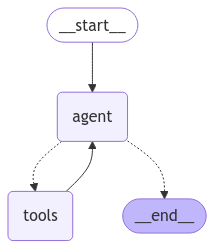

# Hotel Booking Chatbot

An intelligent conversational interface for querying hotel booking data using natural language processing and SQL generation.

Check out the deployed version on: [URL](https://logical-witty-ocelot.ngrok-free.app)

## 📝 Overview

This hotel booking chatbot allows users to interact with hotel reservation data through natural language queries. The system interprets questions, generates appropriate SQL queries, executes them against the database, and provides human-readable answers based on the results.

## ✨ Features

- **Natural Language Understanding**: Process user queries about hotel booking data
- **Automated SQL Generation**: Convert natural language to optimized SQL queries
- **RAG**: Query any hotel related details from the sample file [`data\sample_hotel_brochure.txt`](data\sample_hotel_brochure.txt).
- **Data Analysis**: Extract insights from hotel bookings and reservations
- **Contextual Responses**: Generate human-friendly answers from query results

## 📸 Screenshots

### Analytics


### Chatbot


### Data Entry


## 📈 Data Processing & Visualization

The dataset was cleaned, and all graphs were generated using **Kaggle**.  
You can find the complete notebook in [`notebooks/hotel-booking.ipynb`](notebooks/hotel-booking.ipynb).  

## 🏗️ Architecture

The project uses a multi-stage pipeline architecture:

1. **Query Agent**: Processes user questions and coordinates the workflow



*Generated from [`services\sql_agent\agent.py`](services\sql_agent\agent.py)*

2. **SQL Writer**: Transforms natural language questions into SQL queries


*Generated from [`services\sql_agent\agent.py`](services\sql_agent\agent.py)*

3. **Query Executor**: Runs SQL against the hotel database
4. **Answer Generator**: Formats results into natural language responses

## 💻 Technologies

- **LangGraph**: AI agent workflow management
- **LLMs**: Natural language processing and understanding
- **SQLite**: Database for hotel booking data

## 📊 Dataset

The dataset contains hotel booking information including:

- Booking details (dates, lengths of stay, guest information)
- Hotel information (resort or city hotels)
- Booking status (check-out, canceled, no-show)
- Financial data (ADR, revenue)
- Customer demographics

Key columns include:
- `hotel`: Hotel type (Resort Hotel or City Hotel)
- `is_canceled`: Booking cancellation status
- `arrival_date_*`: Booking date information
- `stays_in_weekend_nights`/`stays_in_week_nights`: Duration of stay
- `adults`, `children`, `babies`: Guest information
- `reservation_status`: Current booking status
- `adr`: Average Daily Rate

## 🚀 Installation

```bash
# Clone the repository
git clone https://github.com/yourusername/hotel-booking-chatbot.git
cd hotel-booking-chatbot

# Install dependencies
pip install -r requirements.txt

uvicorn main:app
```

#### Setup database (If needed)

```bash
# Generate and load the hotel dataset
python models/database.py

# Create the chat table
python models/chat.py
```

## 🔧 Usage

### Using the Query Agent

```python
from services.sql_agent.agent import query_agent

# Ask a question in natural language
question = "What percent of customers have cancelled in the past year?"
result = query_agent(question)

# Access the components of the response
print(f"Question: {question}")
print(f"SQL Query: {result['query']}")
print(f"Result: {result['result']}")
print(f"Answer: {result['answer']}")
print(f"Time taken: {result['time_taken']}")
```

### Example Queries

- "What percent of customers have cancelled in the past year?"
- "What places can I visit nearby the hotel?"
- "Does the hotel have WiFi?"
- "Which month had the highest booking revenue?"
- "What is the average length of stay for guests with children?"
- "Show me the top 5 countries with the most bookings"